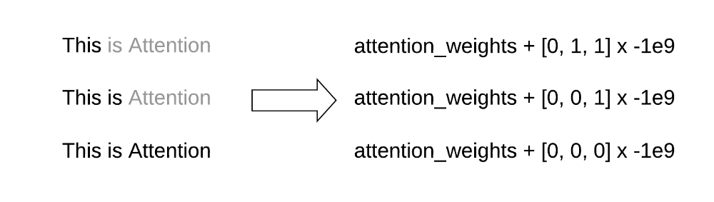

# Abstractive Text Summarization using Transformer

- Implemntation of the state of the art Transformer Model from "Attention is all you need", Vaswani et. al.
  https://arxiv.org/abs/1706.03762

- Inshorts Dataset: https://www.kaggle.com/shashichander009/inshorts-news-data


## Blog Links

Part-I: https://towardsdatascience.com/transformers-explained-65454c0f3fa7 

Part-II: https://medium.com/swlh/abstractive-text-summarization-using-transformers-3e774cc42453

# Transformers Explained

Text from https://towardsdatascience.com/transformers-explained-65454c0f3fa7


This post is an in-depth elucidation of the Transformer model from the well-known paper “[Attention is all you need](https://arxiv.org/abs/1706.03762)” by Google Research. This model has been a pioneer to many SOTA (state of the art) approaches in sequence transduction tasks (any task which involves converting one sequence to another). Following are the contents of this post:

# Contents

1. Overview of Sequence to Sequence models
2. Why Transformer?
3. Attention? Self-Attention!
4. What is a Transformer?
5. Conclusion

This is going to be a long one, so sit tight!

# Overview of Sequence to Sequence Models

\
seq2seq in GNMT, visualization by [Google AI Blog](https://ai.googleblog.com/2016/09/a-neural-network-for-machine.html)

The sequence to sequence encoder-decoder architecture is the base for sequence transduction tasks. It essentially suggests encoding the complete sequence at once and then using this encoding as a context for the generation of decoded sequence or the target sequence.

> One may relate this to the human tendency of first ‘listening’ to a sentence(sequence) completely and then responding accordingly be it a conversation, translation, or any similar task.

The seq2seq model consists of separate RNNs at encoder and decoder respectively. The encoded sequence is the *hidden state* of the RNN at the encoder network. Using this encoded sequence and (usually) word-level generative modeling, seq2seq generates the target sequence. Since encoding is at the word-level, for longer sequences it is difficult to preserve the context at the encoder, hence the well-known attention mechanism was incorporated with seq2seq to ‘*pay attention*’ at specific words in the sequence that prominently contribute to the generation of the target sequence. Attention is weighing individual words in the input sequence according to the impact they make on the target sequence generation.

# Why Transformer?

Sequence to Sequence with RNNs is great, with attention it’s even better. Then what’s so great about Transformers?

The main issue with RNNs lies in their inability of providing parallelization while processing. The processing of RNN is sequential, i.e. we cannot compute the value of the next timestep unless we have the output of the current. This makes RNN-based approaches slow.

This issue, however, was addressed by Facebook Research wherein they suggested using a **convolution-based** approach that allows incorporating parallelization with GPU. These models establish hierarchical representation between words, where the words that occur closer in sequences interact at lower levels while the ones appearing far from each other operate at higher levels in the hierarchy. ConvS2S and ByteNet are two such models. The hierarchy is introduced to address long-term dependencies.

\
Multi-step attention form ConvS2S via [Michal Chromiak's blog](https://mchromiak.github.io/articles/2017/Sep/12/Transformer-Attention-is-all-you-need/#.XreFtRbhU5l)

Although this achieves parallelization, it is still computationally expensive. The number of operations per layer incurred by RNNs and CNNs is way more unreasonable as compared to the quality of results they offer. The original Transformer paper has put forth a comparison of these parameters for the competent models:

\
Comparison of RNN-based, CNN-based and Self-Attention models based on computational efficiency metrics

Here, d (or *d_model*) is the representation dimension or embedding dimension of a word (usually in the range 128–512), n is the sequence length (usually in the range 40–70), k is the kernel size of the convolution and r is the attention window-size for restricted self-attention. From the table, we can infer the following:    

* Clearly, the per-layer computational complexity of self-attention is way less than that of others.
* With respect to sequential operations, except RNNs, all other approaches offer parallelization, hence their complexity is O(1).
* The final metric is maximum path length, which superficially means the complexity for *attending* long-term dependencies or distant words. Since convolutional models use hierarchical representations, their complexity is nlog(n), while self-attention models attend all the words at the same step, hence their complexity is O(1).

The Transformer uses the self-attention mechanism where *attention weights* are calculated using all the words in the input sequence at once, hence it facilitates parallelization. In addition to that, since the per-layer operations in the Transformer are among words of the same sequence, the complexity does not exceed O(n²d). Hence, the transformer proves to be effective (since it uses attention) and at the same time, a computationally efficient model.

# Attention? Self-Attention!

In the previous section, we discussed that the Transformer uses self-attention as a means for effective computation. In this section, we will decipher, what exactly is self-attention and how is it used in the Transformer.

## Query, Key, and Value

The attention mechanism as a general convention follows a Query, Key, Value pattern. All three of these are words from the input sequence that are meant to operate with each other in a certain pattern. The query and key initially undergo certain operations, the output is then (usually) multiplied with the value. This will get clearer in the next sub-section where we will see a pictorial depiction of how self-attention works.

## Self-attention

\
Self-Attention

As mentioned earlier, self-attention is ‘attending’ words from the same sequence.

> Superficially speaking, self-attention determines the impact a word has on the sentence

In the picture above, the working of self-attention is explained with the example of a sentence, “This is Attention”. The word “This” is operated with every other word in the sentence. Similarly, the attention weights for all the words are calculated (here, “is” and “Attention”). There is no concept of ‘*hidden state*’ here. The inputs are used directly. This removes sequentiality from the architecture, hence allowing parallelization.

In case of Transformer, **Multi-Head Attention** is used, which is covered later in the post.

# What is a Transformer?

So far, we have seen mechanisms implemented in the Transformer. Hereafter, we will actually see how these adjoining mechanisms and several components specific to the model are incorporated. **We will try and build a Transformer bottom-up**

## Positional Encoding

\
Positional Encodings in Transformer via “[Attention is all you need](https://arxiv.org/abs/1706.03762)”

If you observe, the self-attention computations have no notion of ordering of words among the sequences. Although RNNs are slow, their sequential nature ensures that the order of words is preserved. So, to elicit this notion of positioning of words in the sequence, *Positional Encodings* are added to the regular input embeddings. The dimension of positional encodings is the same as the embeddings (*d_model*) for facilitating the summation of both. In the paper, positional encodings are obtained using:

\
Using sinusoids for positional encodings via “[Attention is all you need](https://arxiv.org/abs/1706.03762)”

Here, *i* is the dimension and pos is the position of the word. We use sine for even values (2i) of dimensions and cosine for odd values (2i + 1). There are several choices for positional encodings — learned or fixed. This is the fixed way as the paper states learned as well as fixed methods achieved identical results.

> The general idea behind this is, for a fixed offset k, PEₚₒₛ₊ₖ can be represented as linear function of PEₚₒₛ.

## Masking

\
Masking used in Multi-Head Attention via “[Attention is all you need](https://arxiv.org/abs/1706.03762)”

There are two kinds of masks used in the multi-head attention mechanism of the Transformer.

### 1. Padding Mask

The input vector of the sequences is supposed to be fixed in length. Hence, a *max_length* parameter defines the maximum length of a sequence that the transformer can accept. All the sequences that are greater in length than *max_length* are truncated while shorter sequences are padded with zeros. The zero-paddings, however, are not supposed to contribute to the attention calculation nor in the target sequence generation. The working of padding mask is explained in the adjacent figure. This is an optional operation in the Transformer.

\
Working of a Padding Mask

### 2. Look-ahead Mask

While generating target sequences at the decoder, since the Transformer uses self-attention, it tends to include all the words from the decoder inputs. But, practically this is incorrect. Only the words *preceding* the current word may contribute to the generation of the next word. Masked Multi-Head Attention ensures this. The working of the look-ahead mask is explained in the adjacent figure.

\
Working of Look-ahead Mask

The following snippet of code explains how padding helps:
```
>>> a = tf.constant([0.6, 0.2, 0.3, 0.4, 0, 0, 0, 0, 0, 0])
>>> tf.nn.softmax(a)
<tf.Tensor: shape=(10,), dtype=float32, numpy=
array([0.15330984, 0.10276665, 0.11357471, 0.12551947, 0.08413821,
       0.08413821, 0.08413821, 0.08413821, 0.08413821, 0.08413821],
      dtype=float32)>
>>> b = tf.constant([0.6, 0.2, 0.3, 0.4, -1e9, -1e9, -1e9, -1e9, -1e9, -1e9])
>>> tf.nn.softmax(b)
<tf.Tensor: shape=(10,), dtype=float32, numpy=
array([0.3096101 , 0.20753784, 0.22936477, 0.25348732, 0.        ,
       0.        , 0.        , 0.        , 0.        , 0.        ],
      dtype=float32)>
```

## Scaled Dot-Product Attention

\
Scaled Dot-Product Attention via “[Attention is all you need](https://arxiv.org/abs/1706.03762)”

This is the main ‘Attention Computation’ step that we have previously discussed in the Self-Attention section. This involves a few steps:

1. **MatMul**: This is a matrix dot-product operation. First the Query and Key undergo this operation. The operation can be mathematically represented as follows:\
**MatMul(Q, K) = Q.Kᵀ**
2. **Scale**: The output of the dot-product operation can lead to large values which may mess with the softmax in the later part. Hence, we scale them by dividing them by a scaling factor **√dₖ**.
3. **Mask**: The optional padding mask is already discussed in the masking section above.
4. **Softmax**: The softmax function brings down the values to a probability distribution i.e. [0, 1].

\
Final equation of Scaled Dot-Product Attention via “[Attention is all you need](https://arxiv.org/abs/1706.03762)”

## Multi-head Attention

\
Multi-Head Attention via “[Attention is all you need](https://arxiv.org/abs/1706.03762)”

Multi-Head Attention is essentially the integration of all the previously discussed micro-concepts.

In the adjacent figure, *h* is the number of heads. As far as the math is concerned, the initial inputs to the Multi-Head Attention are split into h parts, each having Queries, Keys, and Values, for *max_length* words in a sequence, for *batch_size* sequences. The dimensions of Q, K, V are called *depth* which is calculated as follows: **depth = d_model % h**

In other words, the embeddings of each word has $h$ parts, one per head.

This is the reason why ***d_model* needs to be completely divisible by h**. So, while splitting, the *d_model* shaped vectors are split into h vectors of shape depth. These vectors are passed as Q, K, V to the scaled dot product, and the output is ‘**Concat**’ by again reshaping the $h$ vectors into 1 vector of shape *d_model*. This reformed vector is then passed through a feed-forward neural network layer.

## Point-Wise Feed Forward Network and Residual Dropout

\
Point-wise FFN and Residual Dropout via “[Attention is all you need](https://arxiv.org/abs/1706.03762)”

The Point-wise feed-forward network block is essentially a two-layer linear transformation which is used identically throughout the model architecture, usually after attention blocks.

For Regularization, a dropout is applied to the output of each sub-layer before it is added to the inputs of the sub-layer and normalized.

## And finally, we have the complete Transformer!

\
Transformer via “[Attention is all you need](https://arxiv.org/abs/1706.03762)”

All the components are assembled together to build the Transformer. The Encoder block is the one in the left and Decoder to the right.

> The Encoder and the Decoder blocks may be optionally fine-tuned to Nₓ units to adjust the model.

# Conclusion
In this post, we’ve seen the issues with RNN-based approaches in sequence transduction tasks and how the revolutionary, Transformer model addresses them. Later, we studied the mechanisms underlying the Transformer and their working. Finally, we saw how various components and the underlying mechanisms work with the Transformer.

# References

“Attention is all you need” Original Transformer Paper: https://arxiv.org/abs/1706.03762

Seq2Seq paper: https://arxiv.org/abs/1409.3215

Bahdanau Attention Paper: https://arxiv.org/abs/1409.0473

ConvS2S and ByteNet Papers: https://arxiv.org/abs/1705.03122 , https://arxiv.org/abs/1610.10099